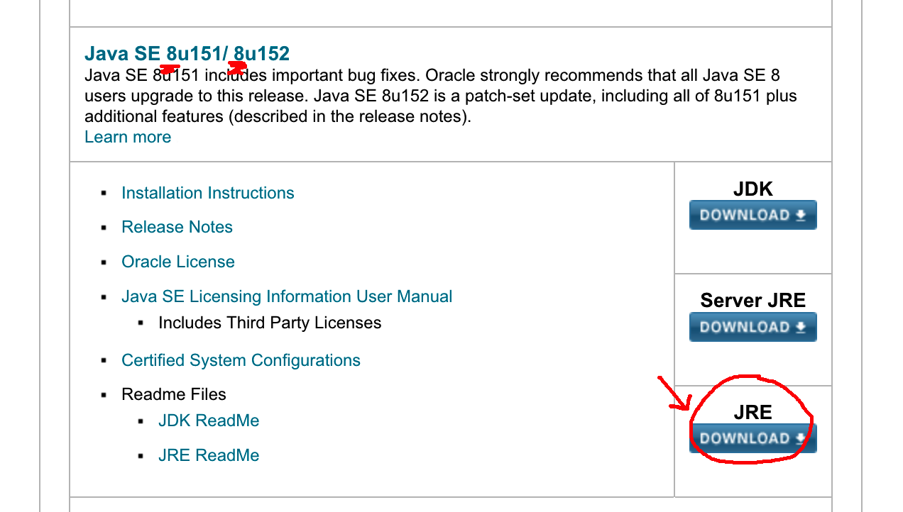

# UTSU - A cross-platform vocal synthesis frontend

Compatible (in theory) with all voicebanks, files, and engines created with or for the UTAU software--however, the two programs have no code in common and both user features and backend processing can and will be different.

Supported languages: English, Español, 日本語, 中文, Italiano

## Installation instructions

### The easy way--installers!

The Mac installer can be found on the [releases page](https://github.com/titinko/utsu/releases).

The Windows installer can be found on the [releases page](https://github.com/titinko/utsu/releases).

### The reliable way--a JAR file

For Mac, Windows, Linux:
First, you'll need to make sure your computer runs Java.  You can download the latest Java engine [here](http://www.oracle.com/technetwork/java/javase/downloads/index.html).

You'll need Java 8, not Java 7 or Java 9, and you'll want a JRE, not a JDK.  

NOTE FOR LINUX USERS: You'll need to download [Oracle Java](https://www.digitalocean.com/community/tutorials/how-to-install-java-with-apt-get-on-ubuntu-16-04) as Utsu does not work with the default OpenJDK.

Next, download the Utsu executable as a ZIP from the [releases page](https://github.com/titinko/utsu/releases).

Unzip the downloaded file and you should see a JAR file and an assets folder.  Confirm that the assets folder and the Utsu file are in the same parent folder, and double-click the JAR file to start Utsu.  If the program doesn't run properly the first time, try closing and double-clicking the JAR file again.  If it still doesn't work, you can try running it from the terminal:
> cd /path/to/jarfile 
> java -jar utsu-0.1-jfx.jar

Downloading the JAR file is much more space-efficient than using the installer, if you're worried about that kind of thing.

## Building from source

Please install Maven v. 4.0.0 or higher.
Please ensure your Java version is 8 or higher.

Navigate to the same directory as the pom.xml file and type:
> mvn clean verify

in the command line.  You can look up various other Maven commands to test, deploy, etc.

See also https://github.com/titinko/utsu/wiki/Compiling for platform-specific compilation instructions.
